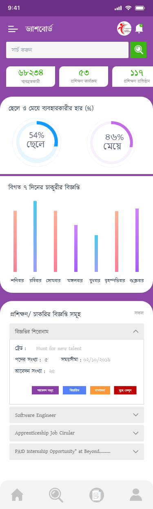
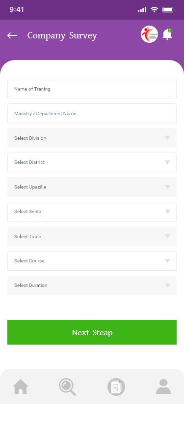

# Skills-App
This project is aimed at providing demand-based skills development training to unemployed youths, which plays a major role in increasing the overall production of industrial enterprises and preventing waste of raw materials.
Module of this App: 
<h4 style="text-align:center">1. Main Module 
 . Dashboard 
   
 . Sign In 
    
 . Sign Up 
    
 . Recent Jobs 
     
  
  2. Trainee Module  
   . Dashboard 
     
   . Trainee profile 
     
   . Trainee Survey 
      
      
    
  
