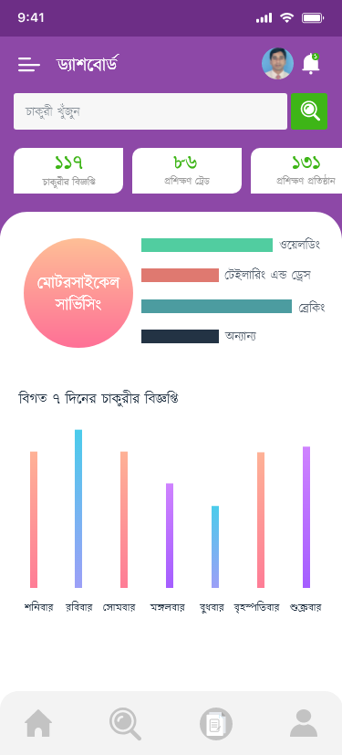

# Skills-App
This project is aimed at providing demand-based skills development training to unemployed youths, which plays a major role in increasing the overall production of industrial enterprises and preventing waste of raw materials.
Module of this App: 
<h3 style="text-align: center;">1. Main Module</h3> 
 . Dashboard 
   
 . Sign In 
    
 . Sign Up 
    
 . Recent Jobs 
     
  
 <h3 style="text-align: center;"> 2. Trainee Module <h3> 
   . Dashboard 
     
   . Trainee profile 
     
   . Trainee Survey 
      
      
 
  <h3 style="text-align: center;"> 3. Volunteer Module <h3> 
   . Dashboard 
     
   . Volunteer profile 
     
   . Volunteer Survey 
      
 
   <h3 style="text-align: center;"> 3. Training center Module <h3> 
    . Dashboard 
     
   . Want job 
   
   . New Job 
     
   . New Training 
     
              
 
 
    
  
